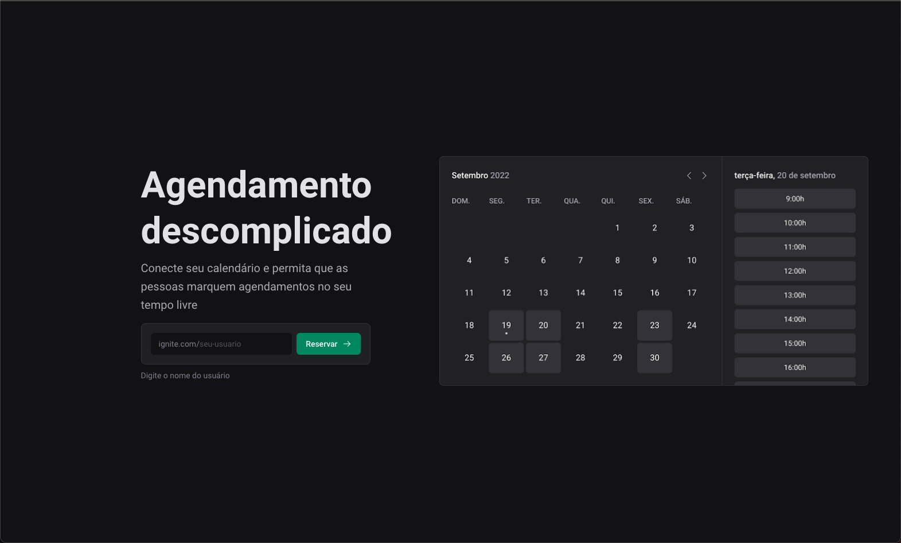

# Ignite Call

Projeto desenvolvido em um dos módulos do bootcamp da Rocketseat, que permite o login social com Google para realizar o cadastro na plataforma, conectar com o calendário e fazer agendamentos salvando no MySQL e integrando com o google agendas.

## Demonstração

https://ignite-call-lemon-two.vercel.app/

  

## Tecnologias

- **Geral**

  - Typescript
  - Zod
  - Dayjs

- **Front**

  - NextJS
  - ReactJS
  - Stitches
  - React Query

  - Axios
  - React Hook form

- **Back**
  - Prisma
  - MySQL
